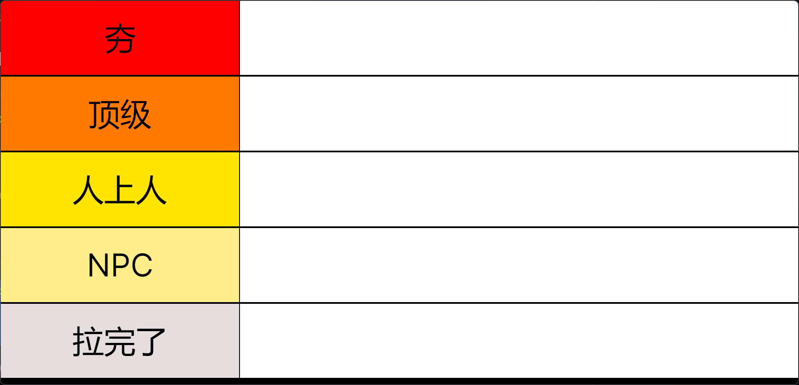
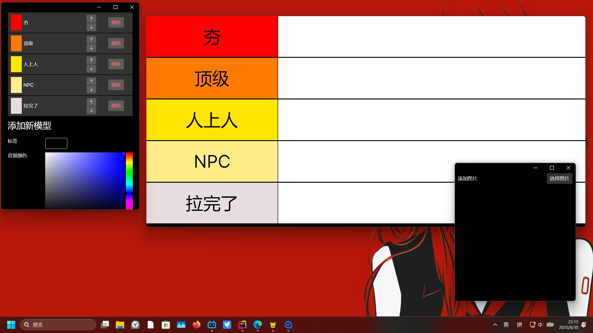

# **TierList**从夯到拉排行
_前言：之前在b站总是看到这种排行榜视频，但是发现各种人制作情况却参差不一，有些想法出众的作者，却因为工具的问题导致传达不出来他想表达的含义，于是我开发了这款软件。

## 使用教程
1，软件的三个部分

软件启动后会连续打开三个窗口，分别是主窗口，等级设置窗口和添加图片窗口。
主窗口关闭后三个窗口同时关闭，

1.1 主窗口

通过点击主窗口的等级栏，可以唤起不小心关闭的其余两个窗口。

