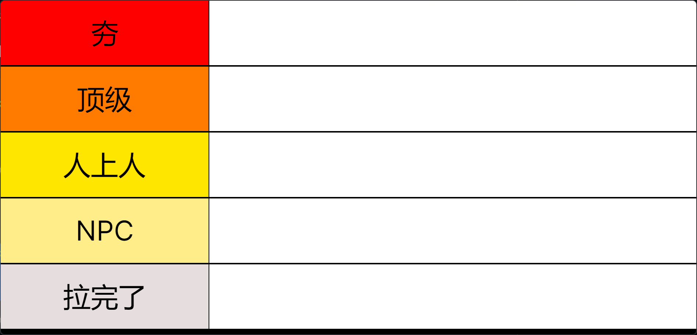
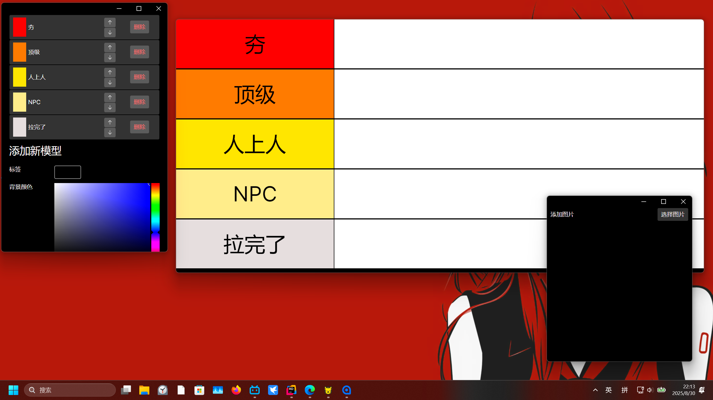
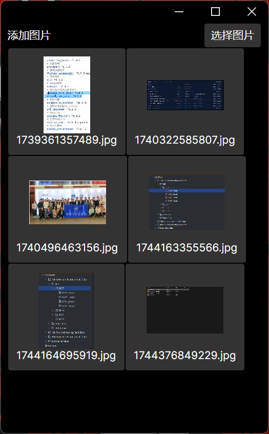
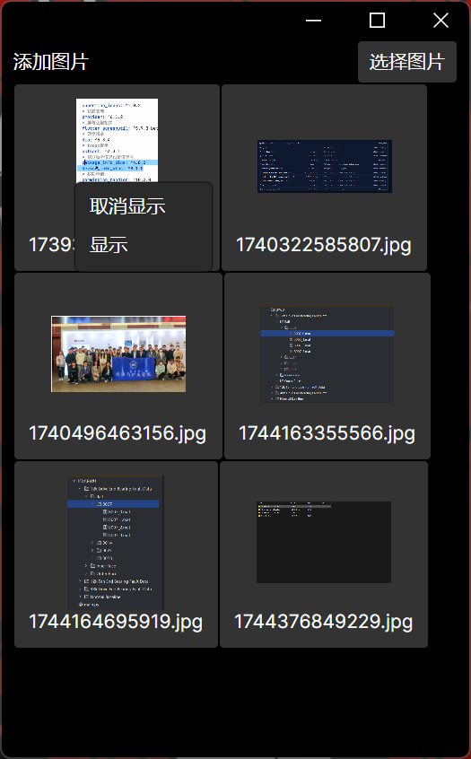

# **TierList**从夯到拉排行
_前言：之前在b站总是看到这种排行榜视频，但是发现各种人制作情况却参差不一，有些想法出众的作者，却因为工具的问题导致传达不出来他想表达的含义，于是我开发了这款软件。

蓝凑云下载链接：https://wwmh.lanzoul.com/iyfOo34z41sb

## 使用教程
## 1. 软件的三个部分

软件启动后会连续打开三个窗口，分别是主窗口，等级设置窗口和添加图片窗口。
主窗口关闭后三个窗口同时关闭，

### 1.1 主窗口

通过点击主窗口的等级栏，可以唤起不小心关闭的其余两个窗口。

### 1.2 等级设置窗口

这里可以通过箭头来显示调整顺序，默认添加的等级会被添加的最后，删除可以删除这个等级。

**注意！**这里的顺序和切换会实时影响主界面。

下面可以添加新的等级，添加的等级会自动添加到等级栏的末尾。可以自由选择你喜欢的颜色。

### 1.3 添加图片窗口

选择文件并添加，可以选择多个文件

右键可以选择在主界面上显示。

## 2. 软件的实战
具体实战，如下：